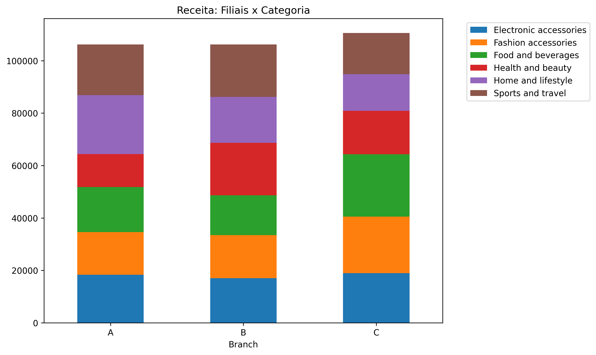
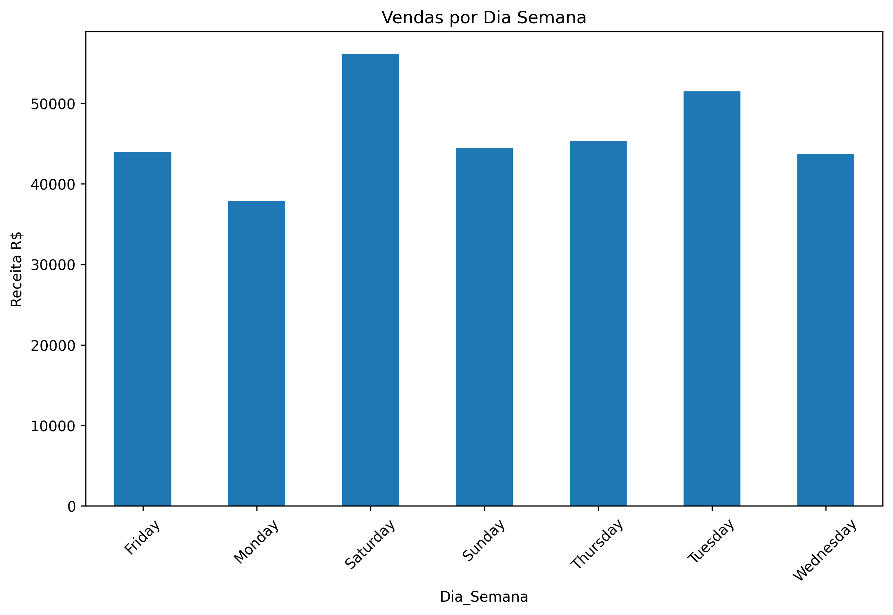

# Supermarket Sales Analysis

## Insights Principais

**Filiais**: C lidera (ticket R$337, 34% receita, melhor Rating)  
**Dias**: Sáb+Ter 33% vs Seg+Qua 25% (**+24% oportunidade**)  
**Clientes**: Mulheres Member R$337 ticket (84k receita)  
**Produtos**: Food&Beverages líder absoluto  
**Pagamento**: Ewallet domina volume  
**Margem**: 4.76% uniforme (foco volume)

## Recomendações Imediatas

1. **Promo Ewallet quartas** (+24% dias fracos)  
2. **Estoque Food sáb 15h** (pico vendas)
3. **Copiar Filial C** (A/B ticket baixo)
4. **Equipe reforçada** 13h-16h

## Gráficos

[Notebook completo →](Projeto/analise_mercado.ipynb)